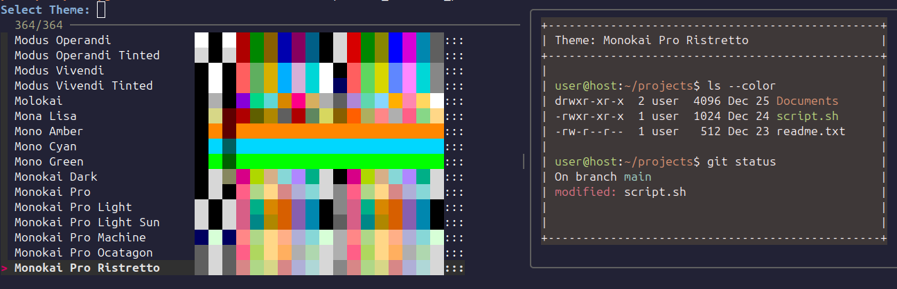

# GNOME Terminal Theme Selector

A visual theme selector for GNOME Terminal that works around the dropdown selection bug. Perfect for when you've downloaded all the [Gogh](https://github.com/Gogh-Co/Gogh) themes and want to actually use them.

## The Problem

After downloading themes with Gogh, GNOME Terminal's profile dropdown can become unresponsive or buggy, making it impossible to switch between your beautiful collection of terminal themes.

## The Solution

This tool provides an interactive theme selector using `fzf` with:
- **Live color previews** showing actual terminal output
- **Color palette bars** for quick visual identification  
- **Instant theme switching** for the current terminal
- **Default theme setting** for new terminals

## Screenshots

### Theme Selection Interface


## Installation

1. **Download the scripts**:
   ```bash
   git clone https://github.com/your-username/gnome-terminal-theme-selector.git
   cd gnome-terminal-theme-selector
   chmod +x *.sh
   ```

2. **Install dependencies**:
   ```bash
   # Ubuntu/Debian
   sudo apt install fzf
   
   # Fedora
   sudo dnf install fzf
   
   # Arch
   sudo pacman -S fzf
   ```

## Usage

Run the theme selector:
```bash
./select_terminal_profile.sh
```

**Controls:**
- `↑/↓` or `j/k` - Navigate themes
- `Enter` - Select theme
- `Esc` - Cancel selection
- Live preview updates automatically

**What happens when you select a theme:**
1. Current terminal immediately switches to the selected theme
2. You'll be prompted to set it as the default for new terminals
3. Choose `y` to make it default, or `n` to keep current default

## Requirements

- GNOME Terminal
- `fzf` (fuzzy finder)
- `dconf` (should be installed with GNOME)

## How It Works

The tool reads GNOME Terminal profiles directly from `dconf`, extracts color information, and presents them in an interactive interface. It handles GNOME's specific color format and provides real-time previews that show how your terminal will actually look.

## Troubleshooting

**"No themes found"**
- Make sure you have GNOME Terminal profiles installed (try Gogh)
- Check that `dconf` can access `/org/gnome/terminal/legacy/profiles:/`

**"Theme didn't change"**
- Ensure you're running the script from within GNOME Terminal
- Some terminals may require restarting to show theme changes

**"Preview looks wrong"**
- The preview simulates common terminal output
- Actual appearance may vary based on your shell prompt and applications

## Thanks

This project exists because GNOME Terminal's dropdown gets wonky with too many themes. Props to the [Gogh](https://github.com/Gogh-Co/Gogh) project for making terminal themes accessible to everyone.

## License

MIT License - see [LICENSE](LICENSE) file.
